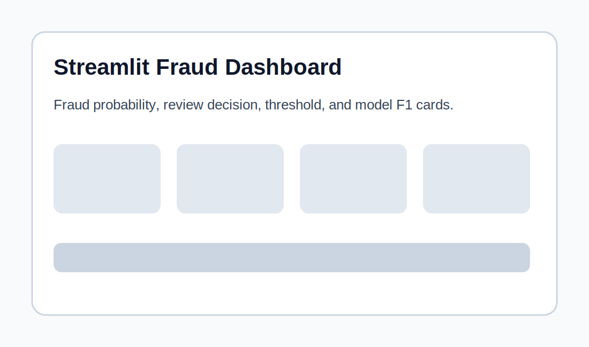
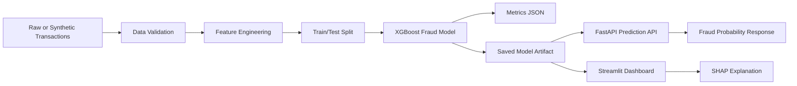
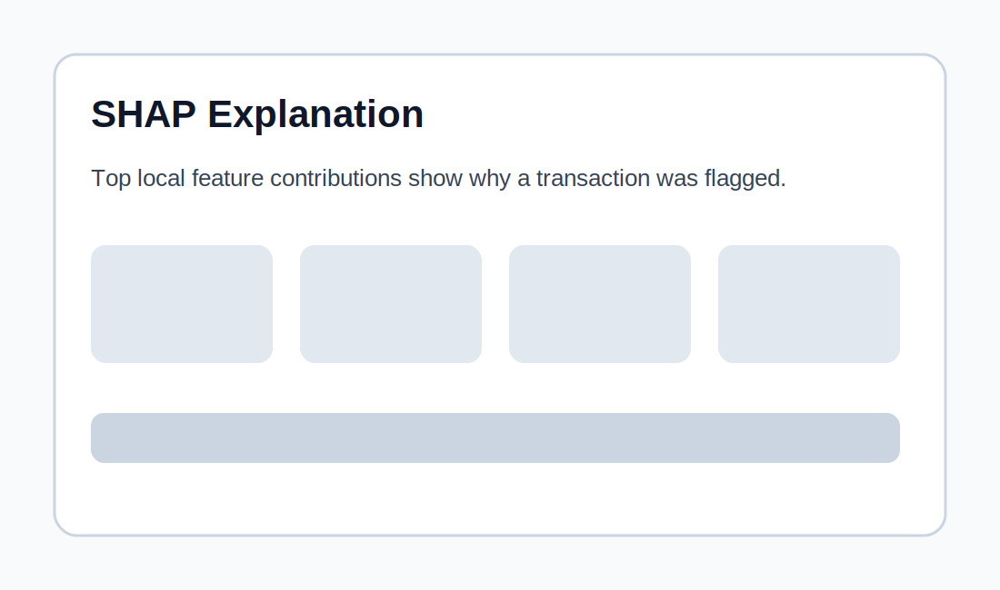
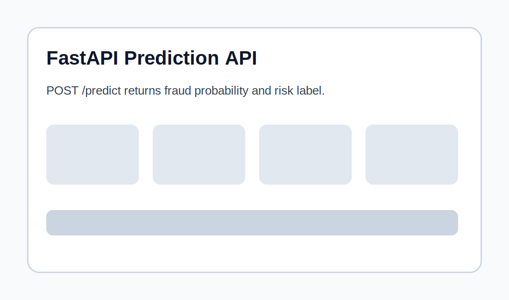

# Fraud Detection with Explainable AI + Streamlit Dashboard

> **LinkedIn-style summary:** Built an end-to-end fraud detection system using Python, XGBoost, SHAP, FastAPI, Streamlit, Docker, and GitHub Actions. The project trains a fraud risk model, evaluates business-focused metrics such as precision, recall, F1-score, ROC-AUC, PR-AUC and latency, and provides an interactive dashboard where users can test transactions and understand predictions using SHAP explanations.



## 1. Problem Statement

Financial institutions need to detect suspicious transactions quickly while reducing customer friction from false alarms. This project builds a machine learning system that estimates the probability of fraud for each transaction and explains which features drive the prediction.

The goal is not only to build a classifier, but to show a complete data science workflow:

- data generation and preparation
- exploratory analysis
- fraud model training
- business-focused evaluation
- explainable AI with SHAP
- FastAPI prediction endpoint
- Streamlit dashboard
- Docker deployment
- automated tests and CI workflow

## 2. Dataset

The default project uses a reproducible synthetic transaction dataset created by `src/data_generator.py`.

Synthetic features include transaction amount, transaction time, merchant risk score, customer age, account age, failed attempts, recent transaction velocity, foreign transaction flag, card-present flag, device trust score, weekend indicator, night transaction indicator, and fraud label.

Why synthetic data?

- It runs without Kaggle credentials.
- It avoids sensitive financial data.
- It still demonstrates realistic fraud patterns and portfolio-level ML engineering.

You can replace the synthetic data with a real approved dataset such as a credit-card fraud dataset if licensing allows.

## 3. Method

The project uses an **XGBoost binary classifier** because gradient boosting often performs well on structured tabular fraud data.

Main modelling choices:

- Stratified train/test split
- Class imbalance handling using `scale_pos_weight`
- Decision threshold set to `0.35` by default
- Metrics beyond accuracy: precision, recall, F1, ROC-AUC, PR-AUC, confusion matrix and latency
- SHAP explanations for local interpretability

## 4. Architecture Diagram



## 5. Project Structure

```text
fraud-xai-streamlit/
├── app/
│   └── streamlit_app.py
├── api/
│   └── main.py
├── src/
│   ├── data_generator.py
│   ├── features.py
│   ├── metrics.py
│   ├── predict.py
│   └── train.py
├── tests/
├── notebooks/
│   └── fraud_detection_eda.ipynb
├── docs/
├── screenshots/
├── data/
├── models/
├── MODEL_CARD.md
├── Dockerfile
├── render.yaml
├── requirements.txt
└── README.md
```

## 6. Quick Start

### 6.1 Create environment

```bash
python -m venv .venv
source .venv/bin/activate   # macOS/Linux
# .venv\Scripts\activate    # Windows

pip install -r requirements.txt
```

### 6.2 Generate dataset

```bash
python -m src.data_generator --rows 50000 --output data/raw/transactions.csv
```

### 6.3 Train model

```bash
python -m src.train --input data/raw/transactions.csv --model-dir models
```

### 6.4 Run Streamlit dashboard

```bash
streamlit run app/streamlit_app.py
```

### 6.5 Run FastAPI service

```bash
uvicorn api.main:app --reload
```

Then open the API docs at:

```text
http://127.0.0.1:8000/docs
```

## 7. Example API Request

```bash
curl -X POST "http://127.0.0.1:8000/predict" \
  -H "Content-Type: application/json" \
  -d '{
    "amount": 250.0,
    "hour": 23,
    "day_of_week": 5,
    "merchant_risk_score": 0.72,
    "customer_age": 31,
    "account_age_days": 120,
    "previous_failed_attempts": 2,
    "num_transactions_24h": 7,
    "foreign_transaction": 1,
    "card_present": 0,
    "device_trust_score": 0.28
  }'
```

Example response:

```json
{
  "fraud_probability": 0.81,
  "prediction": 1,
  "risk_label": "High risk",
  "threshold": 0.35
}
```

## 8. Results

Example results are stored in `models/metrics_example.json`.

| Metric | Example Value |
|---|---:|
| Accuracy | 0.873 |
| Precision | 0.371 |
| Recall | 0.724 |
| F1-score | 0.491 |
| ROC-AUC | 0.886 |
| PR-AUC | 0.463 |
| Latency per 1,000 transactions | 4.6 ms |

### Why accuracy is not enough

Fraud detection is usually imbalanced. A model can achieve high accuracy by predicting most transactions as legitimate. Therefore, this project reports precision, recall, F1-score, ROC-AUC and PR-AUC.

### Business interpretation

- **False positives**: legitimate customers may experience friction or blocked payments.
- **False negatives**: fraudulent transactions may create financial loss.
- **Threshold tuning**: the threshold should be selected based on the cost of fraud loss versus review cost.

## 9. Screenshots

### Dashboard Overview


### SHAP Explanation



### FastAPI Docs



## 10. Explainable AI

The Streamlit dashboard calculates local SHAP values for each input transaction. This helps answer:

- Why was this transaction flagged?
- Which features increased fraud risk?
- Which features reduced fraud risk?
- Is the decision explainable to an analyst?

Typical high-risk drivers may include high transaction amount, night transaction, foreign transaction, high merchant risk score, many recent transactions, low device trust score, and previous failed attempts.

## 11. Deployment

### Option A: Docker

```bash
docker build -t fraud-xai-streamlit .
docker run -p 8501:8501 fraud-xai-streamlit
```

### Option B: Render

This repo includes `render.yaml`.

1. Push the repository to GitHub.
2. Create a new Render Web Service.
3. Select Docker environment.
4. Render will use the included Dockerfile.

### Option C: Hugging Face Spaces

For Streamlit Spaces:

1. Create a new Hugging Face Space.
2. Choose Streamlit.
3. Upload the repository files.
4. Make sure `requirements.txt` is included.
5. Add generated model artifacts or allow the app startup to train/generate artifacts.

## 12. Testing

```bash
pytest -q
```

GitHub Actions workflow is included in `.github/workflows/tests.yml`.

## 13. Model Card

See [`MODEL_CARD.md`](MODEL_CARD.md) for intended use, limitations, bias and fairness risks, governance assumptions, and recommended improvements.

## 14. CV Bullet Points

- Built an end-to-end fraud detection system using Python, XGBoost, SHAP, FastAPI, Streamlit and Docker.
- Designed a fraud risk dashboard that explains individual predictions using SHAP local feature contributions.
- Evaluated the model using precision, recall, F1-score, ROC-AUC, PR-AUC, confusion matrix values and prediction latency.
- Created a production-style repository with modular source code, API endpoint, tests, model card, architecture diagram and CI workflow.

## 15. Future Improvements

- Add real transaction data with permission and proper anonymisation.
- Add MLflow experiment tracking.
- Add drift monitoring.
- Add fairness analysis.
- Add fraud ring detection using graph features.
- Add alerting and analyst feedback loop.
- Add model registry and automated retraining.
