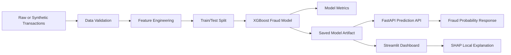

# Architecture Diagram

## Component Summary

- `src/data_generator.py`: creates reproducible synthetic transactions.
- `src/features.py`: defines model features and target handling.
- `src/train.py`: trains XGBoost, evaluates metrics, and saves artifacts.
- `src/predict.py`: reusable prediction logic.
- `api/main.py`: FastAPI service for real-time scoring.
- `app/streamlit_app.py`: user-facing dashboard with SHAP explanations.
- `tests/`: basic quality checks.
- `Dockerfile`: containerised demo deployment.
